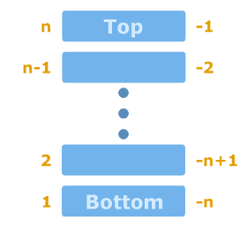

Lua stack - the key to understanding the Lua C API
====

Most of the Lua C functions take `index` as argument. It is the index of the Lua stack. At first sight the stack can be confused with the call stack. These two are not same the thing. The call stack in Lua is called traceback. The stack referenced by the functions is used to transfer values between Lua and your C code. Understanding that **the stack and traceback are two different things** is the key to understanding the Lua C API.

Index
----

Each element in the stack represents a Lua value.  The elements are indexed by an integer. The number can be either positive or negative. Positive indexes (1, 2, 3...) address elements from the bottom of the stack (elements which were added first). Negative indexes (-1, -2, -3...) address elements from the top of the stack (elements which were added last). Zero is an invalid index.

Let's assume that the stack contains _n_ elements. Then elements at index 1 and -_n_ point the bottom of the stack while element at index -1 and _n_ point the top of the stack. The element at index 2 points the element above the bottom one. The element at index -2 points the element below the top one. The stack with indexes is depicted below.

 Lua stack with indexes

Basic functions
----

Most of the Lua C functions take the stack index as argument. Here we will cover only the basic ones. We will explain others in upcoming posts about the Lua C API.

Let's start with getting the size of the stack. The function [`lua_gettop(lua_State *L)`](https://www.lua.org/manual/5.3/manual.html#lua_gettop) returns the stack size which is the index of the top element at the same time.

Pushing and popping
----

There are several functions which push values onto the top of the stack. We list only the basic and most often used ones. The functions are:
- [`lua_pushboolean(lua_State *L, int b)`](https://www.lua.org/manual/5.3/manual.html#lua_pushboolean) pushes a boolean value `b`.
- [`lua_pushnumber(lua_State *L, lua_Number n)`](https://www.lua.org/manual/5.3/manual.html#lua_pushnumber) pushes a float number `n`.
- [`lua_pushinteger(lua_State *L, lua_Integer n)`](https://www.lua.org/manual/5.3/manual.html#lua_pushinteger) push an integer `n`.
- [`lua_pushstring(lua_State *L, const char *s)`](https://www.lua.org/manual/5.3/manual.html#lua_pushstring) push a string `s`. Lua makes an internal copy of `s` so the memory pointed by `s` can be freed after the function returns.
- [`lua_pushnil(lua_State *L)`](https://www.lua.org/manual/5.3/manual.html#lua_pushnil) pushes nil.

There are 3 more functions which push string [`lua_pushfstring(...)`](https://www.lua.org/manual/5.3/manual.html#lua_pushfstring), [`lua_pushlstring(...)`](https://www.lua.org/manual/5.3/manual.html#lua_pushlstring), [`lua_pushvfstring(...)`](https://www.lua.org/manual/5.3/manual.html#lua_pushvfstring). The details can be found in the Lua [manual](https://www.lua.org/manual/5.3/).

Values from the stack are popped using [`lua_pop(lua_State *L, int n)`](https://www.lua.org/manual/5.3/manual.html#lua_pop). This function pops `n` elements from the stack.

Checking if value exists
----

There are functions which allow to check if a value in the stack exists or if its nil. The function [`lua_isnone(lua_State *L, int index)`](https://www.lua.org/manual/5.3/manual.html#lua_isnone) returns 1 if the value at the given index doesn't exist, 0 otherwise. In other words, it checks if the index is valid. The function [`lua_isnil(lua_State *L, int index)`](https://www.lua.org/manual/5.3/manual.html#lua_isnil) returns 1 if the value at given index exists and is nil, 0 otherwise.

The function [`lua_isnoneornil(lua_State *L, int index)`](https://www.lua.org/manual/5.3/manual.html#lua_isnoneornil) returns 1 if the value at the given doesn't exist or is nil, 0 otherwise. `lua_isnoneornil` is used in functions in the Lua functions implemented in C which accept variable number of arguments. This topic will be coverted in a later post.

Checking type
----

Lua allows to check if values in the stack are of given types. Here we will limit only to the basic and most often used ones. All the below functions return 1 if the value at the given index is of given type and 0 otherwise: 
- [`lua_isboolean(lua_State *L, int index)`](https://www.lua.org/manual/5.3/manual.html#lua_isboolean) checks a boolean,
- [`lua_isinteger(lua_State *L, int index)`](https://www.lua.org/manual/5.3/manual.html#lua_isinteger) checks an integer,
- [`lua_isnumber(lua_State *L, int index)`](https://www.lua.org/manual/5.3/manual.html#lua_isinteger) checks a number or string that can be converted to a number,
- [`lua_isstring(lua_State *L, int index)`](https://www.lua.org/manual/5.3/manual.html#lua_isstring) checks a string or a number which is automatically converted to a string,
- [`lua_istable(lua_State *L, int index)`](https://www.lua.org/manual/5.3/manual.html#lua_istable) checks a table,
- [`lua_isfunction(lua_State *L, int index)`](https://www.lua.org/manual/5.3/manual.html#lua_isfunction) checks a function (Lua and C).

There are other functions which check types. They are described in the Lua [manual](https://www.lua.org/manual/5.3/).

Other functions
----

There are other stack-related functions. One of them is [`lua_remove(lua_State *L, int index)`](https://www.lua.org/manual/5.3/manual.html#lua_remove) which removes the element at the given index. The others are:
- [`lua_replace(lua_State *L, int index)`](https://www.lua.org/manual/5.3/manual.html#lua_replace),
- [`lua_rotate(lua_State *L, int index, int n)`](https://www.lua.org/manual/5.3/manual.html#lua_rotate),
- [`lua_settop(lua_State *L, int index)`](https://www.lua.org/manual/5.3/manual.html#lua_settop).

Conclusion
----

The functions described above will be used in examples in following posts so there are no examples here. The Lua stack and its index will be easier to understand then.

