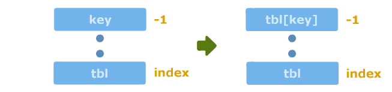
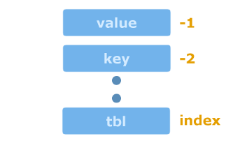

Manipulating Lua tables in C/C++
====

Everything in Lua is either a single value (boolean, number, string, function...) or a table. Even objects whose values are accessed using the dot or colon operator are tables. Metatables are tables. Tables are an inseparable element of Lua and there isn't much we can do in Lua without tables. This tutorial explains how to manipulate tables in C/C++.

Getting a table value
----

There are two functions which allow to get a value from a table:
[`lua_getfield()`](https://www.lua.org/manual/5.3/manual.html#lua_getfield) and [`lua_gettable()`](https://www.lua.org/manual/5.3/manual.html#lua_gettable). They are declared as:
```c
int lua_getfield(lua_State *L,int index,const char *key);
int lua_gettable(lua_State *L,int index);
```

Both functions push the value `tbl[key]` onto the stack where `tbl` is the table at the given `index`. Both functions return the type of the pushed value. The former function takes `key` from the arguments and simply pushes the value. The latter function takes the key from the stack which must be at the top, removes the key from stack and pushes the value. A call to [`lua_gettable()`](https://www.lua.org/manual/5.3/manual.html#lua_gettable) is depicted below.

<div style="text-align:center;"><br/>Stack before and after calling <code>lua_gettable()</code></div>

Both of the functions may trigger the `__index` [metamethod](https://www.lua.org/manual/5.3/manual.html#2.4).

An example function which prints a value of a string-string table is listed below. The function does nothing if the value is nil (does not exist).

```cpp
void printStrStrTableValue(lua_State *L,int index,const char *key) {
    lua_getfield(L,index,key); // push the value
    
    // do nothing if the value does not exist
    if (lua_isnil(L,-1)) {
        lua_pop(L,1); // pop the value
        return;
    }
    
    const char *value = lua_tostring(L,-1);
    std::cout << value;
    lua_pop(L,1); // pop the value
}
```

Setting a table value
----

There are two functions which allow to set a value for a table [`lua_setfield()`](https://www.lua.org/manual/5.3/manual.html#lua_setfield) and [`lua_settable()`](https://www.lua.org/manual/5.3/manual.html#lua_settable). They are declared as:
```c
void lua_setfield(lua_State *L,int index,const char *key);
void lua_settable(lua_State *L,int index);
```

The table must be in the stack at the given `index`. The value to set must be at the top of the stack. 

[`lua_setfield()`](https://www.lua.org/manual/5.3/manual.html#lua_setfield) sets the value for the table under the given `key`. In other words, it does the equivalent to `tbl[key] = value` where `tbl` is the table at the given `index` and `value` is the element at the top of the stack. This function pops the value from the stack. 

[`lua_setfield()`](https://www.lua.org/manual/5.3/manual.html#lua_setfield) is limited to setting a value under a string key only. [`lua_settable()`](https://www.lua.org/manual/5.3/manual.html#lua_settable) allows to set a value under any key. The key must be in the stack just below the top (at index -2). It this situation the index can be of any type. It's depicted in the figure below. 

<div style="text-align:center;"><br/>Stack before calling <code>lua_settable()</code></div>

[`lua_settable()`](https://www.lua.org/manual/5.3/manual.html#lua_settable) takes the key and value from the stack and sets it for the table at the given `index`. It does exactly what [`lua_setfield()`](https://www.lua.org/manual/5.3/manual.html#lua_setfield) does. However, the key is taken from the stack instead from the function arguments. This function pops both the key and the value from the stack. 

Both of the functions may trigger the `__newindex` [metamethod](https://www.lua.org/manual/5.3/manual.html#2.4).

Table length
----

Table length can be obtained using the function [`lua_len()`](https://www.lua.org/manual/5.3/manual.html#lua_len) which is equivalent to the [`#`](https://www.lua.org/manual/5.3/manual.html#3.4.7) operator. Please refer to the manual to find out in detail how the operator works. [`lua_len()`](https://www.lua.org/manual/5.3/manual.html#lua_len) is declared as: 

```cpp
void lua_len(lua_State *L,int index);
```

The function pushes the table length onto the stack. It may trigger the `__len` 
[metamethod](https://www.lua.org/manual/5.3/manual.html#2.4).

A function getting table length could be implemented as:
```cpp
int getTableLength(lua_State *L,int index) {
    lua_len(L,index); // push the length
    int length = lua_tointeger(L,-1);
    lua_pop(L,1); // pop the length
    return length;
}
```

Building a table
----

Building a table is performed in two steps. First, an empty table is pushed onto the stack. Second, values are set for the table using [`lua_setfield()`](https://www.lua.org/manual/5.3/manual.html#lua_setfield) or [`lua_settable()`](https://www.lua.org/manual/5.3/manual.html#lua_settable). An empty table is created using either [`lua_newtable()`](https://www.lua.org/manual/5.3/manual.html#lua_newtable) or [`lua_createtable()`](https://www.lua.org/manual/5.3/manual.html#lua_createtable):
```c
void lua_newtable(lua_State *L);
void lua_createtable(lua_State *L,int narr,int nrec);
```

Both of the functions create an empty table and push it onto the stack. The difference is that [`lua_createtable()`](https://www.lua.org/manual/5.3/manual.html#lua_createtable) takes hints related to the number of elements the table will contain. 

A pseudo-code for building a table could look like listed below. First, it creates an empty table and gets its index. Second, for each value it pushes a key and the corresponding value and sets the value under the key for the table. The functions leaves the table on the stack.

```cpp
lua_newtable(L);
int index = lua_gettop(L);
for each key/value {
   lua_pushkey(L,...);
   lua_pushvalue(L,...);
   lua_settable(L,index);
}
```

The listing below is an implementation of the pseudo-code. This function creates a table and sets strings under integer keys for the table.

```cpp
void createIntStrTable(lua_State *L,const vector<string> &values) {
    lua_newtable(L);
    int index = lua_gettop(L);
    
    int key = 1;
    vector<string>::const_iterator itr;
    for (itr = values.begin(); itr != values.end(); ++itr) {
        // key
        lua_pushinteger(L,key);
        key++;
        
        // value
        const char *value = (*itr).c_str();
        lua_pushstring(L,value);
        
        // set table[key] = value (pops the key and the value from the stack)
        lua_settable(L,index);
    }
    // the new table is at top of the stack
}
```

Iterating over a table
----

A table is iterated using the function [`lua_next()`](https://www.lua.org/manual/5.3/manual.html#lua_next) declared as:
```c
int lua_next(lua_State *L,int index)
```

The function pops a key from the stack and pushes the *next* key-value pair. This means that the function does not push the key it just popped, but the *next* key in the table. After the function returns, the value is at the top of the stack and the key is just below the top. Typically key and value are processed in the loop body after which the value is popped from the stack and the key is left for the next iteration. [`lua_next()`](https://www.lua.org/manual/5.3/manual.html#lua_next) returns 0 and pushes nothing if there are no more elements in the table.

[`lua_next()`](https://www.lua.org/manual/5.3/manual.html#lua_next) always expects a key to be in the stack. The question is *what is the first key*? The answer is *nil*. Nil is simply pushed onto the stack as the first key.

A pseudo-code for iterating over a table could look like listed below.

```cpp
// push the first key
lua_pushnil(L);

// while there are elements in the table
while (lue_getnext(L,index)) {
    // Process the key and value: key is at index -2 and value is at index -1
    // ...

    // pop the value only and keep the key for the next iteration
    lua_pop(L,1);
}
```

The example function below iterates over a table and prints key-value pairs. It assumes that keys are integers and values are strings.

```cpp
void iterateOverIntStrTable(lua_State *L,int index) {
    // push the first key
    lua_pushnil(L);
    
    // while there are elements in the table
    while (lua_next(L,index) != 0) {
        // key at index -2
        int key = (int)lua_tointeger(L,-2);
        
        // value at index -1
        const char *value = lua_tostring(L,-1);
        
        // pop the value, keep the key for the next iteration
        lua_pop(L,1);
        
        // print
        cout << "[" << key << "] = " << value << "\n";
    }
}
```

Raw functions
----

The functions described above may trigger metamethods. Lua comes with corresponding functions which access values without calling metamethods. The functions are:

- [`lua_rawget()`](https://www.lua.org/manual/5.3/manual.html#lua_rawget) which corresponds to [`lua_gettable()`](https://www.lua.org/manual/5.3/manual.html#lua_gettable),
- [`lua_rawset()`](https://www.lua.org/manual/5.3/manual.html#lua_rawset) which corresponds to [`lua_settable()`](https://www.lua.org/manual/5.3/manual.html#lua_settable),
- [`lua_rawlen()`](https://www.lua.org/manual/5.3/manual.html#lua_rawlen) which corresponds to [`lua_len()`](https://www.lua.org/manual/5.3/manual.html#lua_len),
- [`lua_rawgeti()`](https://www.lua.org/manual/5.3/manual.html#lua_rawgeti) gets a value under an integer key,
- [`lua_rawseti()`](https://www.lua.org/manual/5.3/manual.html#lua_rawseti) sets a value under an integer key.

The raw functions are declared as:

```cpp
int lua_rawget(lua_State *L,int index);
void lua_rawset(lua_State *L,int index);
size_t lua_rawlen(lua_State *L,int index);
int lua_rawgeti(lua_State *L,int index,lua_Integer key);
void lua_rawseti(lua_State *L,int index,lua_Integer key);
```